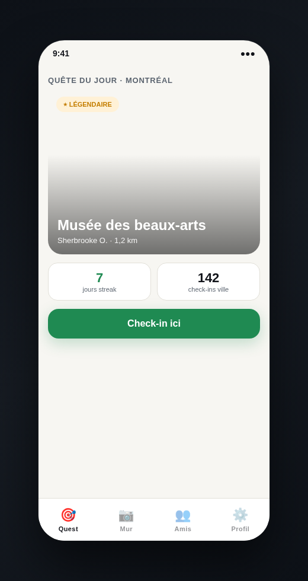
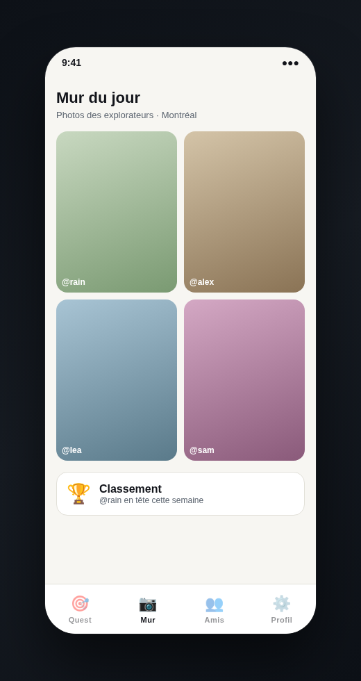
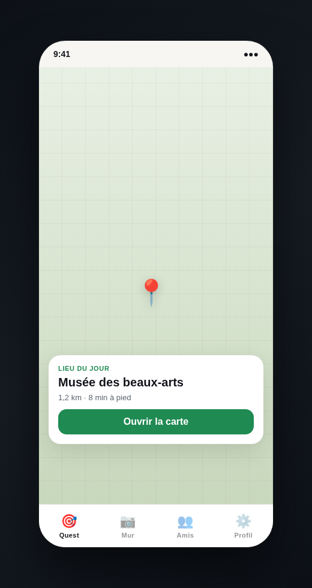

# Quest

> Un rendez-vous quotidien dans ta ville. **Un lieu. Tout le monde. Aujourd'hui.**

Chaque jour, Quest révèle **le même POI** pour tous les joueurs d'une ville — tiré de Wikipedia autour du centre-ville. Check-in sur place, partage une photo, grimpe au classement.

| Badge | Rareté |
|-------|--------|
| ○ | Commun |
| ★ | Rare (1× / semaine) |
| ★★ | Légendaire (1× / mois) |

App Android **Kotlin / Compose** + API **FastAPI** (serveur local sur ton PC).

Spec produit : [PRODUCT.md](PRODUCT.md) · **Télécharger** : [Quest v0.2.0 — APK](https://github.com/CloudDown/quest/releases/latest)

---

## Installation rapide

### Android (APK)

1. Télécharge l'APK depuis [GitHub Releases](https://github.com/CloudDown/quest/releases/latest).
2. Lance le backend sur ton PC (voir ci-dessous) — même réseau Wi-Fi que le téléphone.
3. Autorise la **localisation** au premier lancement (ville → lieu du jour).

### Développeur

```bash
git clone https://github.com/CloudDown/quest.git
cd quest/mobile_app
./release-github.sh
./configure-device-api.sh lan
```

Backend local :

```bash
cd server && python3 -m venv .venv
.venv/bin/pip install -r requirements.txt
.venv/bin/uvicorn main:app --reload --host 0.0.0.0 --port 8000
# → http://localhost:8000/docs
```

---

## Les 3 écrans

### Quest — lieu du jour



L'écran principal : le POI du jour avec photo Wikipedia.

- **Seed déterministe** `ville + date` → même lieu pour tous
- Badge de **rareté** (commun / rare / légendaire)
- Streak & stats ville · CTA **Check-in**
- Cache DataStore — stable toute la journée, offline après le 1er load

### Mur — photos des explorateurs



Feed social des check-ins du jour.

- Grille de photos postées sur place
- Classement hebdo des joueurs de la ville
- Réactions et validations pair-à-pair (API prête)

### Carte — navigation vers le lieu



Carte OpenStreetMap (osmdroid) avec pin du quest.

- Distance GPS en temps réel
- Sheet récapitulatif du POI
- Ouverture navigation externe

---

## API

| Module | Rôle |
|--------|------|
| `auth/` | Inscription, login JWT, profil |
| `places/` | Wikipedia geosearch + tirage déterministe ville+date |
| `quests/` | Quest du jour figé en DB, check-in, validation |
| `social/` | Mur de photos, leaderboard, réactions |

Mode démo (`QUEST_DEMO_MODE=1`) : comptes seed `rain/rain`, `alex/alex`…

---

## Stack

| Couche | Techno |
|--------|--------|
| Mobile | Kotlin, Compose, osmdroid, Coil, DataStore, Play Services Location |
| API | FastAPI, SQLModel, JWT, SQLite |

Structure : `mobile_app/` + `server/`. Conventions agents : [AGENTS.md](AGENTS.md).
